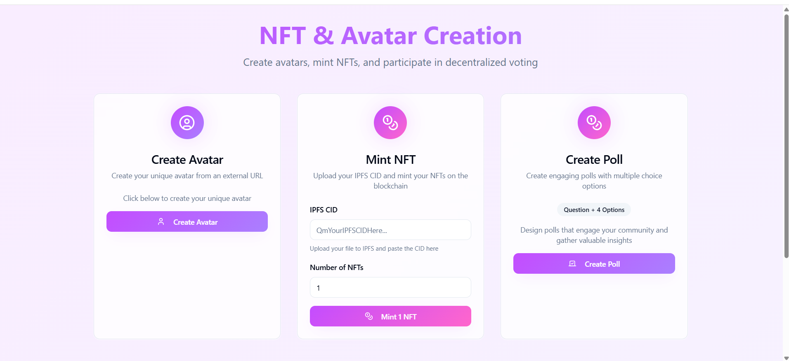
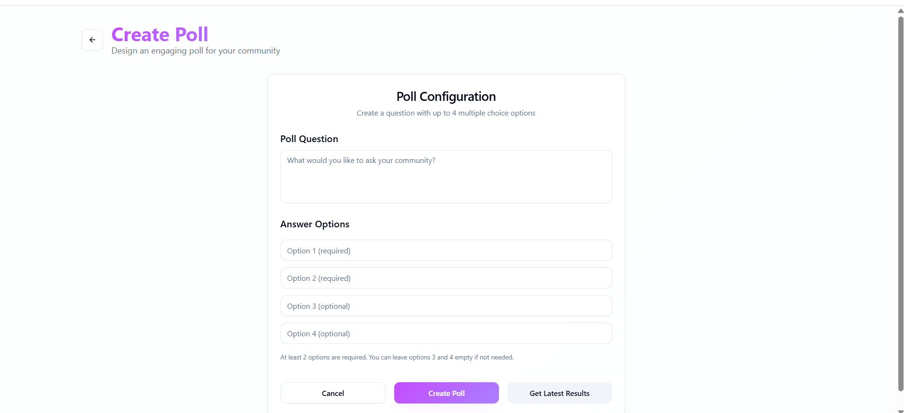
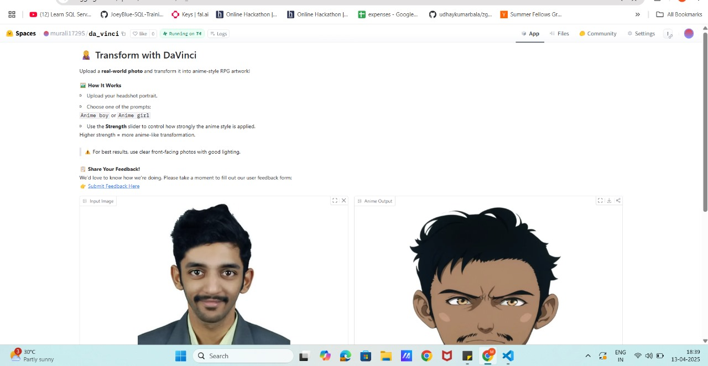
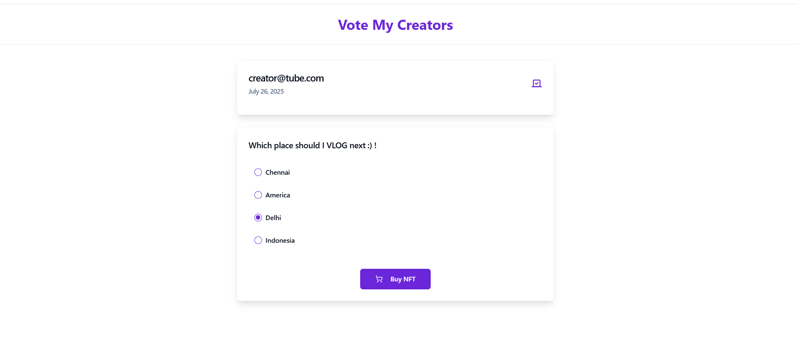

# CreatorDAOx

**CreatorDAOx** empowers creators and influencers to make community-driven decisions through verifiable and decentralized voting. Whether it’s deciding on the next VLOG destination or choosing the next AI tool to explore, decisions are shaped by the voice of the audience—secured via NFT-based ownership. 

These NFTs are not just access tokens; they are uniquely personalized and AI-generated using the creator’s portrait, adding sentimental and economic value. Being tradable on marketplaces, they fuel a vibrant secondary economy within the creator-fan ecosystem.

---

## 🔧 How It Works

1. **Personalized NFT Generation**  
   Creators generate custom avatars using a tailored Stable Diffusion model based on their portraits.

2. **NFT Minting**  
   The generated avatar is minted as an ERC-721 NFT and published on a Core Testnet.

3. **Poll Creation on DAO**  
   The creator sets up a decentralized poll related to upcoming content or decisions.

4. **Community Voting**  
   Fans and followers who own the creator’s NFT gain the right to vote in the DAO poll.

5. **Decentralized Decision Execution**  
   The decision with the most votes is transparently adopted, enabling collaborative content creation.

---

# User Interface
 

