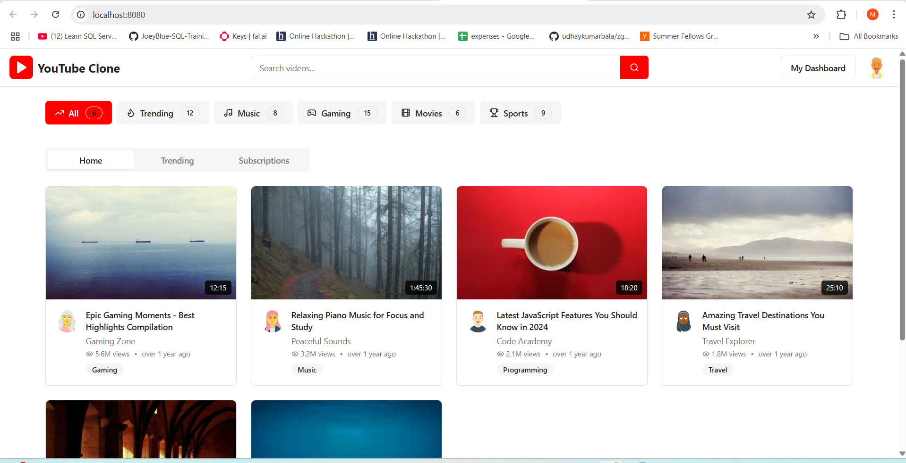

# Core-DAO-BY-NFT
Each decision of the creator and influencer is driven by fair user voting,for example decisions like "which place should I VLOG next ?, Which AI tool should I debug next ?" These are driven by users in unbiased manner by verfying the ownership via NFTs. These NFTs are personalised and AI generated based on creator protraits. They are tradable in Marketplace thus creating a secondary economy in creator-fan ecosystem. 

# How it works
1. Creators generates personalised avatars using Custom Stable diffusion.
2. Mints NFTs with above generated image.
3. Creates a Poll on DAO.
4. Users are provided access to vote after owning the NFTs minted by the creator.
5. Final decision is taken.

# user interface

